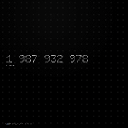

# Memento Mori Countdown Wallpaper

Minimal Wallpaper Engine web wallpaper for a fixed-date countdown.

The wallpaper shows the time remaining until a target date and keeps the layout intentionally stark and typography-driven.

## Features

- Countdown modes: milliseconds, seconds, minutes, hours, days, weeks
- Local font presets: `Doto` and `Space Mono`
- Custom number color with preset override
- Solid background color support
- Optional dot-grid with circular masking around the number
- Optional tick animation on number updates
- Target date line with invalid date fallback
- Layout presets and size control for different screens

## Requirements

- Wallpaper Engine
- A browser-capable web wallpaper setup

## How to use

1. Import this folder as a Wallpaper Engine project.
2. Open the wallpaper properties.
3. Set the target date in `YYYY-MM-DD HH:mm:ss` format.
4. Pick the unit mode, font preset, colors, and visual options.

## Main settings

- `Target date` - fixed countdown target in local time
- `Unit mode` - choose the displayed unit
- `Font preset` - `Doto` or `Space Mono`
- `Number color` - preset or custom color
- `Background color` - optional custom background
- `Dot grid` - toggle and size control
- `Tick animation` - enable or disable number ticking effect

## Project files

- `index.html` - wallpaper entry point
- `styles.css` - layout and visual styling
- `app.js` - runtime logic and Wallpaper Engine property handling
- `project.json` - Wallpaper Engine property definitions
- `assets/fonts/` - bundled fonts used by the wallpaper
